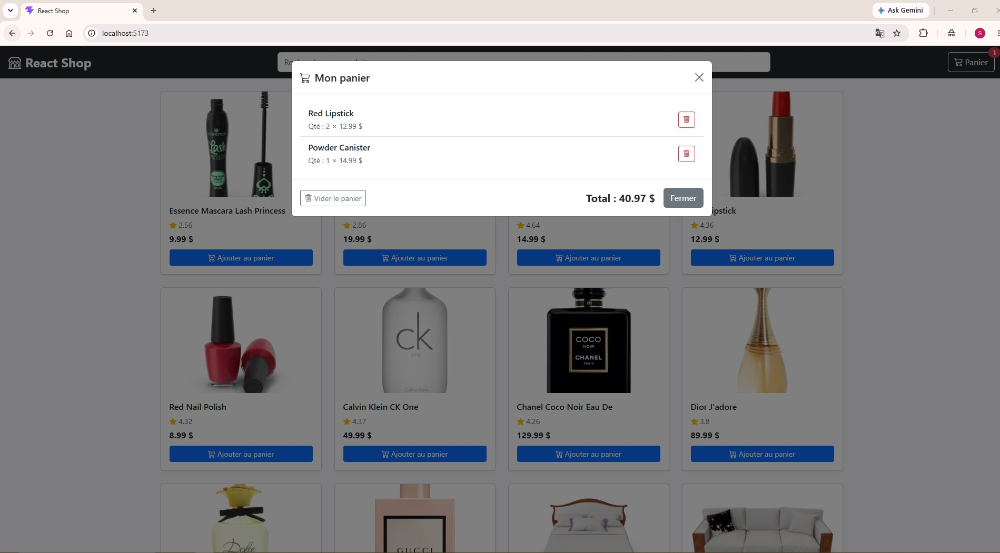
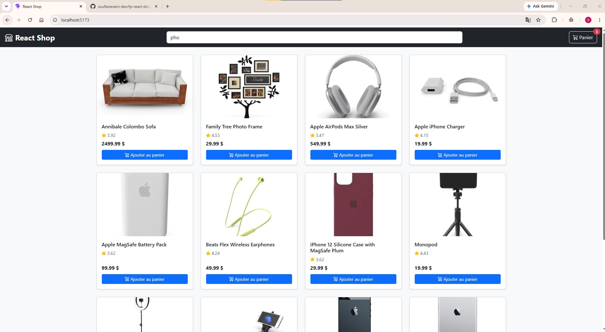

# React Shop — TP Hooks React

## Étape 1 — useState : état de l'application

### Q1.1 — À quoi sert le hook useState ?

`useState` permet de créer un état dans un composant React.
Quand la valeur change, React met à jour la page automatiquement.

---

### Q1.2 — Montrer votre implémentation des trois useState

```jsx
const [searchQuery, setSearchQuery] = useState('');
const [isCartOpen, setIsCartOpen] = useState(false);
const [currentPage, setCurrentPage] = useState(1);
```

---

### Q1.3 — Capture d'écran : la modale s'ouvre et se ferme

**Modale ouverte**


---

# Étape 2 — Composants ProductCard et ProductList

## Q2.1 — Qu'est-ce que le « props drilling » ?

Le props drilling est le passage des données par plusieurs composants.

Quand il y a beaucoup de composants, le code devient plus difficile à lire et à maintenir.

---

## Q2.2 — Montrer le rendu de la grille

```jsx
<div className="row row-cols-1 row-cols-md-3 row-cols-lg-4 g-4">
  {products.map((product) => (
    <div
      key={product.id}
      className="col"
    >
      <ProductCard
        product={product}
        onAddToCart={addToCart}
      />
    </div>
  ))}
</div>
```

---

## Q2.3 — Capture d'écran : la grille avec le produit fictif

**Grille de produits**


---

# Étape 3 — useEffect : chargement des données

## Q3.1 — Pourquoi utiliser useEffect pour les appels réseau ?

`useEffect` lance le `fetch()` après le rendu du composant.
Si on met `fetch()` dans le composant, il sera exécuté à chaque rendu.

---

## Q3.2 — Quel est le rôle du tableau de dépendances [searchQuery, page] ?

Le tableau lance `useEffect` quand `searchQuery` ou `page` change.

- Avec `[]`, le code est exécuté une seule fois.
- Sans tableau, le code est exécuté à chaque rendu.

---

## Q3.3 — Montrer votre implémentation du useEffect dans useProducts

```jsx
useEffect(() => {
  const fetchProducts = async () => {
    try {
      setLoading(true);
      setError(null);

      const skip = (page - 1) * PAGE_SIZE;

      let url = '';

      if (searchQuery) {
        url = `${BASE_URL}/search?q=${searchQuery}&limit=${PAGE_SIZE}&skip=${skip}`;
      } else {
        url = `${BASE_URL}?limit=${PAGE_SIZE}&skip=${skip}`;
      }

      const response = await fetch(url);
      const data = await response.json();

      setProducts(data.products);
      setTotal(data.total);

    } catch (err) {
      setError(err.message);

    } finally {
      setLoading(false);
    }
  };

  fetchProducts();

}, [searchQuery, page]);
```

---

## Q3.4 — Capture d'écran : les produits s'affichent, la pagination fonctionne

**Produits page 2**


# Étape 4 — Hook personnalisé useDebounce

## Q4.1 — Qu'est-ce que le debounce et pourquoi est-il utile ici ?

Le debounce attend un petit temps avant le `fetch()`.

Il évite plusieurs requêtes quand l'utilisateur écrit rapidement.

---

## Q4.2 — Quel est le rôle de la fonction de nettoyage (cleanup) retournée par useEffect ?

`clearTimeout()` supprime l'ancien timer.

Comme ça, un seul timer reste actif.

---

## Q4.3 — Montrer votre implémentation complète de useDebounce

```jsx
export function useDebounce(value, delay) {

  const [debouncedValue, setDebouncedValue] =
    useState(value);

  useEffect(() => {

    const timer =
      setTimeout(() => {

        setDebouncedValue(value);

      }, delay);

    return () => {

      clearTimeout(timer);

    };

  }, [value, delay]);

  return debouncedValue;

}
```

---

## Q4.4 — Preuve du debounce dans les DevTools réseau

**Debounce réseau**


---

# Étape 5 — Hook personnalisé useCart : useCallback + useMemo

## Q5.1 — Pourquoi utiliser useCallback pour addToCart, removeFromCart et clearCart ?

`useCallback` garde la même fonction entre les rendus.

Cela évite de recréer les fonctions à chaque rendu, surtout avec le contexte.

---

## Q5.2 — Pourquoi utiliser useMemo pour cartCount et cartTotal ?

`useMemo` mémorise le résultat d'un calcul.

`useMemo` mémorise une valeur, alors que `useCallback` mémorise une fonction.

---

## Q5.3 — Montrer votre implémentation de addToCart avec useCallback

```jsx
const addToCart =
  useCallback((product) => {

    setCart((prev) => {

      const existingProduct =
        prev.find(
          (item) => item.id === product.id
        );

      if (existingProduct) {

        return prev.map((item) =>

          item.id === product.id
            ? {
                ...item,
                qty: item.qty + 1
              }
            : item

        );

      }

      return [

        ...prev,

        {
          ...product,
          qty: 1
        }

      ];

    });

  }, []);
```

---

## Q5.4 — Preuve de la persistance localStorage

Le test n'est pas encore possible.

À cette étape, le panier n'est pas encore connecté aux composants.

La capture d'écran sera réalisée après l'Étape 6.


---

# Étape 6 — useContext : consommation du contexte

## Q6.1 — Quel problème useContext résout-il par rapport au props drilling ?

Sans `useContext`, la fonction `addToCart` devait être transmise de `App` vers `ProductList`, puis vers `ProductCard`.

Avec `useContext`, chaque composant peut accéder directement au panier sans passer les données par plusieurs composants.

---

## Q6.2 — Montrer l'appel à useCartContext() dans CartModal

```jsx
const {
  cart,
  removeFromCart,
  clearCart,
  cartTotal
} = useCartContext();
```

---

## Q6.3 — Montrer le rendu d'un article du panier

```jsx
<li
  key={item.id}
  className="list-group-item d-flex justify-content-between align-items-center"
>
  <div>
    <span className="fw-semibold">
      {item.title}
    </span>

    <br />

    <small className="text-muted">
      Qté : {item.qty} × {item.price.toFixed(2)} $
    </small>
  </div>

  <button
    className="btn btn-sm btn-outline-danger"
    onClick={() => removeFromCart(item.id)}
  >
    <i className="bi bi-trash"></i>
  </button>
</li>
```

---

## Q6.4 — Capture d'écran : panier fonctionnel

**Panier fonctionnel**



# Étape 7 — Finitions et vérifications

## Checklist finale

- [x] La recherche est débouncée (une seule requête après 400 ms de pause)
- [x] La pagination fonctionne en mode navigation (sans recherche)
- [x] Ajouter le même produit deux fois → la quantité s'incrémente (pas de doublon)
- [x] Le panier est restauré après rafraîchissement de la page (F5)
- [x] Le badge de la NavBar affiche le nombre total d'articles correct
- [x] La suppression d'un article met à jour le badge et le total
- [x] « Vider le panier » vide la liste et le localStorage
- [x] Le total affiché dans la modale est correct

---

## Q7.1 — Bilan : quel hook vous a semblé le plus difficile à comprendre et pourquoi ?

Le hook qui m'a semblé le plus difficile est **useContext**, car il nécessite de comprendre le fonctionnement du Provider et du Consumer pour partager les données entre plusieurs composants sans utiliser le props drilling.

---

## Q7.2 — Capture d'écran finale

**Application complète et fonctionnelle**



---

# Référence rapide des hooks utilisés

| Hook | Fichier(s) | Rôle |
|------|------------|-------|
| useState | App.jsx, useProducts.js, useCart.js, useDebounce.js | Gérer les états locaux |
| useEffect | useProducts.js, useCart.js, useDebounce.js | Effets de bord (fetch, localStorage, timer) |
| useContext | NavBar.jsx, ProductList.jsx, CartModal.jsx | Consommer le contexte panier |
| useCallback | useCart.js | Mémoriser les fonctions du panier |
| useMemo | useCart.js | Calculer cartCount et cartTotal |

---

# Ressources

- Documentation React — Hooks
- API dummyjson.com/products
- Bootstrap 5
- Bootstrap Icons